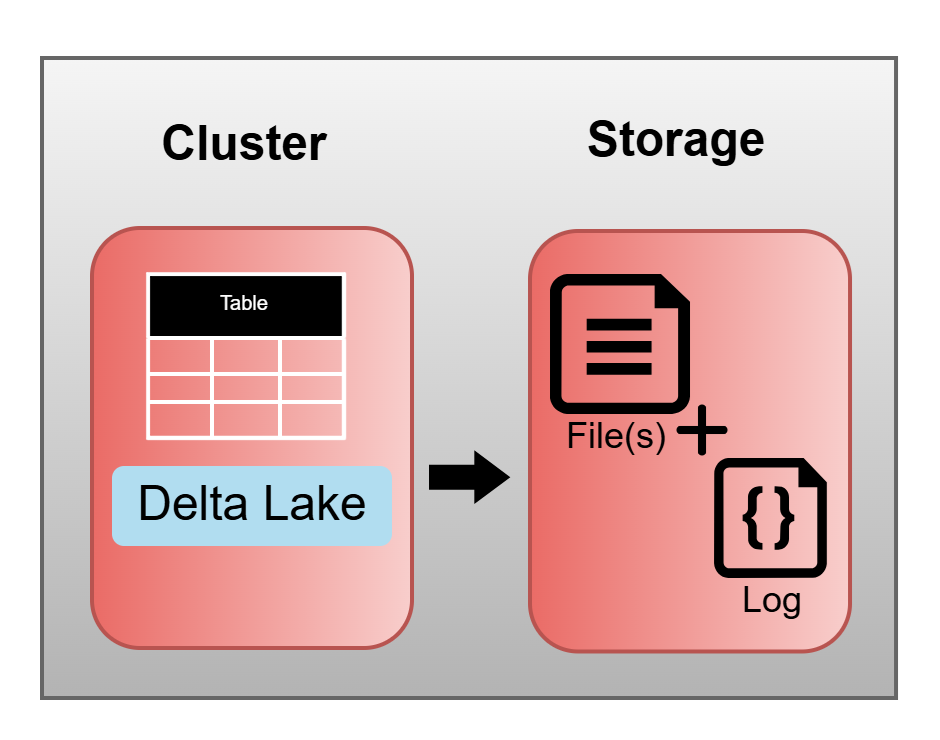

## Delta Lake

An open-source storage framework that enhances data lakes by improving reliability, performance, and consistency.

### Key Features of Delta Lake
- **What it is**:
  - Open-source technology.
  - Storage framework or layer.
  - Enables the Lakehouse architecture.

- **What it is not**:
  - Proprietary technology.
  - A storage format or medium.
  - A data warehouse or database service.

Delta Lake integrates with the cluster as part of the Databricks runtime. Tables are stored as **Parquet files** with an accompanying **transaction log** in JSON format, providing a **single source of truth** and enabling **ACID compliance** for object storage.



### Working with Delta Tables in Notebooks

#### Creating a Delta Table
```sql
CREATE TABLE employees (
  id INT, 
  name STRING, 
  salary DOUBLE
);

INSERT INTO employees VALUES 
  (1, "José", 2100.0),
  (2, "Maria", 2600.5),
  (3, "Antonio", 1900.3); 
```

#### Querying the Table

```sql
SELECT * FROM employees; 
```

#### Exploring Table Metadata

```sql
DESCRIBE DETAIL employees;
```

#### Listing Files

```python
%fs ls 'dbfs:/user/hive/warehouse/employees';
```

*Note: The number of files depends on the number of cluster cores. If the cluster has 4 cores, it will process data in parallel, creating 4 files.*

#### Updating the Table

```sql
UPDATE employees
SET salary = salary + 100
WHERE name LIKE "%o";
```

#### Viewing Table History

```sql
DESCRIBE HISTORY employees;
```

#### Viewing Log Files

```python
%fs ls 'dbfs:/user/hive/warehouse/employees/_delta_log';
```

*Note: .crc files are checksums of the JSON files.*

#### Inspecting a Log File

```python
%fs head 'dbfs:/user/hive/warehouse/employees/_delta_log/<json_file_name>.json';
```

### Advanced Delta Lake Features

- **Time Travel**:
  - Audit data changes with ``` DESCRIBE HISTORY ```
  - Query older versions:
    - By Timestamp:
      ``` SELECT * FROM my_table TIMESTAMP AS OF "2019-01-01"; ```
    - By Version:
      ```sql
      SELECT * FROM my_table VERSION AS OF 36;
      SELECT * FROM my_table@v36;
      ```
  - Rollback Versions:
    ```sql
    RESTORE TABLE my_table TO TIMESTAMP AS OF "2019-01-01";
    RESTORE TABLE my_table TO VERSION AS OF 36;
    ```

- **Compaction (Optmize)**:
  - Compaction: Merges small files to improve performance.
    ``` OPTIMIZE my_table; ```
  - Z-Ordering: Co-locates column information to improve query performance.
    ``` OPTIMIZE my_table ZORDER BY column_name; ```

- **Vacuum**
  - Removes unused or uncommitted files.
   ``` VACUUM my_table [retention period]; ```
   
   *Note: Time travel will not be available after a VACUUM, as old files are deleted.*
